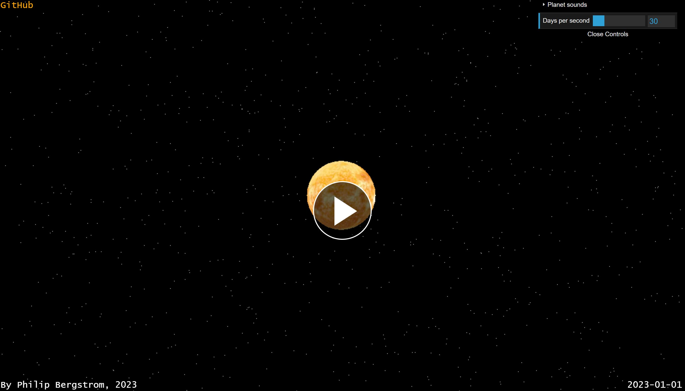

# Solarsounds.js 🌌🎵

Data sonification from orbit data from planets in our solar system.

## Libraries

- [Tone.js](https://github.com/Tonejs) (audio)
- [Three.js](https://github.com/mrdoob/three.js/) (visualization)

## Live Demo

[https://phber.github.io/Solarsounds.js/](https://phber.github.io/Solarsounds.js/)

## Video Demo

## Details

[https://phber.github.io/curiosities/planet-sonification/
](https://phber.github.io/curiosities/planet-sonification/)

